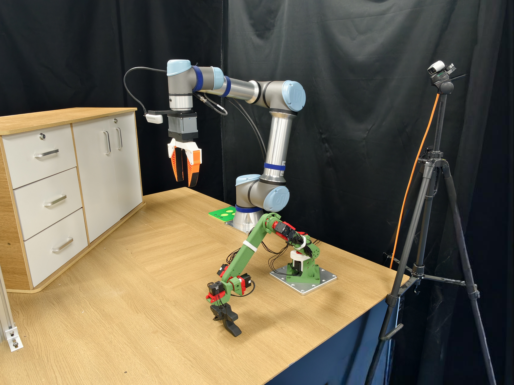
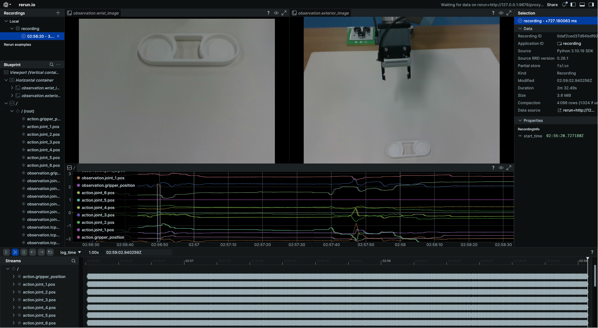
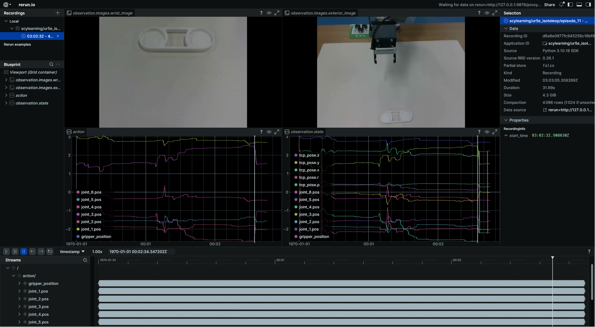

# UR5e Master-Slave Teleoperation Data Collection
<p align="center">
  
  <br>
</p>

## 1. Environment Setup
### 1.1 Create and Activate Conda Environment
```bash
conda create -n ur_data python=3.10
conda activate ur_data
```

### 1.2 Install lerobot
```bash
# Install specific version 0.3.4
git clone https://github.com/huggingface/lerobot.git
cd lerobot
git checkout da5d2f3e9187fa4690e6667fe8b294cae49016d6
pip install -e .
```

### 1.3 Clone and Install UR5e Teleoperation Control Source
```bash
mkdir ur_data_collection && cd ur_data_collection
git clone https://github.com/scy-v/lerobot_ur5e_isoteleop.git
cd lerobot_ur5e_isoteleop
pip install -r requirements.txt # install all packages in editable mode
```

### 1.4 View Available Commands
Run the following command to display all available scrtips:
```bash
ur5e-help
# ==================================================
#  UR5e Teleoperation Utilities - Command Reference
# ==================================================

# Core Commands:
#   ur5e-record           Record teleoperation dataset
#   ur5e-replay           Replay a recorded dataset
#   ur5e-visualize        Visualize recorded dataset

# Utility Commands:
#   utils-joint-offsets   Compute joint offsets for teleoperation

# Tool Commands:
#   tools-check-dataset   Check local dataset information
#   tools-check-rs        Retrieve connected RealSense camera serial numbers

# Shell Tools:
#   map_gripper.sh        Map Gripper Serial Port
#   check_master_port.sh  Get the Master Arm's Persistent Serial Identifier

# Test Commands:
#   test-gripper-ctrl     Run gripper control command (operate the gripper)

# --------------------------------------------------
#  Tip: Use 'ur5e-help' anytime to see this summary.
# ==================================================
```

## 2. Obtain and Configure Necessary Parameters

### 2.1 Get RealSense Camera Serial Number
Please make sure only one camera is connected at a time.
```bash
tools-check-rs
```

### 2.2 Map Gripper Serial Port
For example, map the gripper to `/dev/ur5e_left_gripper` and make sure only one gripper USB device is connected:
```bash
map_gripper.sh ur5e_left_gripper
```
Next, enter the mapped device into the `gripper_port` field in `cfg.yaml`.

### 2.3 Get the Master Arm's Persistent Serial Identifier
Before running this, make sure only one USB device for the master arm is connected:
```bash
check_master_port.sh
```
Next, enter the obtained serial identifier into the `port` field in `cfg.yaml` and set device access permissions:
```bash
sudo chmod 666 <your_master_port>
```

### 2.4 Obtaining Master–Slave Zero-Offset
> **⚠️ Note: The `hardware_offsets` in `cfg.yaml` should store the zero-position offsets between the master and slave arm joints to ensure their zero poses match.**

### 2.5 Obtain Master-Slave Joint Angle Offset Circle
> **⚠️ WARNING: Before recording data, you must complete this step to set the correct joint offset. Otherwise, the slave arm may move unexpectedly.**


Manually move the master arm so that its joint angles roughly match the current joint angles of the slave arm. This is done to calculate the joint angle offset cycle between the master and slave arms. Then run:
```bash
utils-joint-offsets
```
Copy the resulting `joint_offsets` into the corresponding fields in `cfg.yaml`.

## 3. Dataset Recording

### 3.1 Upload Data to Hugging Face (Optional)
1. Set the following in `cfg.yaml`:
```yaml
push_to_hub: True
```
2. Obtain your Hugging Face account token and login:
```bash
huggingface-cli login --token ${HUGGINGFACE_TOKEN} 
huggingface-cli whoami  # Verify successful login
```

### 3.2 Start Recording
1. Turn on **Remote Control** on the UR5e teach pendant.  
2. Verify that the parameters in `cfg.yaml` are correct.  
3. To ensure standardized data collection, please read `9. Dataset Naming and Recording Details` before running the following command:
```bash
ur5e-record
```

<p align="center">
  
  <br>
  <b>Figure 1: Record</b>
</p>

## 4. Dataset Replay
```bash
ur5e-replay # Make sure cfg.yaml is properly configured
```

## 5. Dataset Visualization
```bash
ur5e-visualize # Make sure cfg.yaml is properly configured
```
<p align="center">
  
  <br>
  <b>Figure 2: Visualization</b>
</p>

## 6. Dataset Appending and Resume
If you have already recorded a dataset under the specified `repo_id`, set `resume: True` in `cfg.yaml` and enter the dataset name in `resume_dataset` to continue recording new data on the existing dataset. Then, run the following command:

```bash
ur5e-record
```

## 7. Merge Datasets
If you recorded data in multiple stages, ensure each dataset has a unique `repo_id`. Use the following command to merge them into a single dataset:
```bash
lerobot-edit-dataset 
    --repo_id <merged_repo_id> 
    --operation.type merge 
    --operation.repo_ids "['<repo_id_1>', '<repo_id2>']"
```
- For more dataset processing commands, see [LeRobot](https://huggingface.co/docs/lerobot/using_dataset_tools).

## 8. Recording Control Keys

1. **Right Arrow Key**  
   1. Press the right arrow key: end the current episode and save the data. The program will pause.  
   2. Enter the **reset** phase: press enter key to continue (the slave arm will follow the master arm), use the master arm to return the slave arm to its initial position.  
   3. Press the right arrow key again to start recording the next episode.

2. **Left Arrow Key**  
   - Press to restart the current episode recording (overwrite the current data).

3. **Esc Key**  
   - Press to exit the recording session and save all recorded episodes.

4. **Ctrl+C or Exception**
   - Pressing or on exception: enters exception handling and asks whether to delete the incomplete dataset.
  
## 9. Dataset Naming and Recording Details
### 1. Dataset Naming
<p align="center">
  
  <br>
  <b>Figure 3: Dataset</b>
</p>

<p align="center">
  
  <br>
  <b>Figure 4: Dataset Info</b>
</p>

1. The dataset is by default stored in the `~/.cache/huggingface/lerobot` directory and contains three types of items:

   - `dataset_info.txt`: Automatically records local dataset information, including the following fields: `record_id`, `name`, `task`, `date`, `version`, `user_info`, and `type`. The `user_info` field can be annotated via the `user_notes` entry in `cfg.yaml`.

   - `dataset_info_backup`: When `tools-check-dataset` is used to manually update `dataset_info.txt`, this folder stores backups of the previous records.

   - Dataset folders: Stores the actual dataset contents.

2. Dataset names follow the format `[description]_[date]_[version]`, where:
   - `description` comes from `cfg.yaml` as `repo_id=<user_name>/<description>`;
   - `date` is generated automatically;
   - `version` is incremented automatically if a dataset with the same `repo_id` already exists.
3. Description naming rule: `task.description -> Verb_SourceObject_prep_TargetObject`.  
   For example:  
   `Pick up the green cube and put it into the trash bin -> pick_greencube_into_trashbin`.

### 2. Recording Instructions
1. Complete step `2. Get and configure required parameters`.
2. Fill in the task instruction in `cfg.yaml` under `task.description` and set `repo_id` according to the dataset naming rules.
3. Check and adjust other parameters in `cfg.yaml` to ensure correctness.
4. Run `ur5e-record`. For safety, ensure the master and slave arm joint angles are approximately aligned; `ur5e-record` will automatically perform the `2.4 Master-Slave Joint Angle Error Check`. Then follow `8. Recording Control Keys` to complete the recording.
5. After recording, a `dataset_info.txt` file will be automatically created in the same directory to store local dataset information. If you have manually deleted any datasets, update the `dataset_info.txt` using:
```bash
tools-check-dataset
```